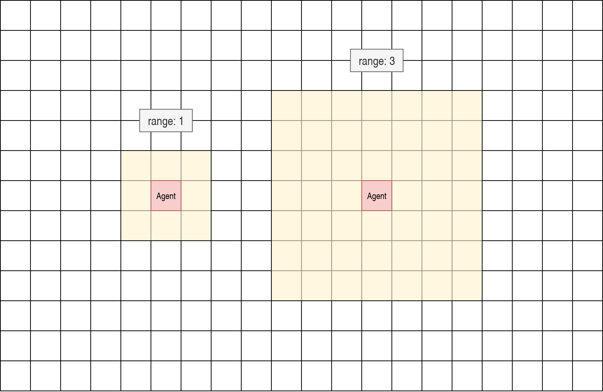

Configuration Guide for Ethical Gardeners Simulation
==============================================================

This tutorial explains how to configure the Ethical Gardeners simulation environment using `Hydra <https://hydra.cc/>`__.
You'll learn about all available configuration options, their meanings, and how to customize your experiments.

Hydra Configuration System Overview
-----------------------------------

Ethical Gardeners uses Hydra for configuration management, providing a modular and flexible way to configure simulations without modifying code.

Configuration Structure
^^^^^^^^^^^^^^^^^^^^^^^

The configuration is organized into several groups:

.. code-block::

    configs/
    ├── config.yaml                # Main configuration file with defaults
    ├── grid/                      # Grid initialization configurations
    │   ├── random.yaml            # Random grid generation
    │   ├── from_code.yaml         # Code-defined grid layout
    │   └── from_file.yaml         # File-based grid layout
    ├── observation/               # Observation strategy configurations
    │   ├── total.yaml             # Full visibility
    │   └── partial.yaml           # Limited visibility
    ├── metrics/                   # Metrics collection configurations
    │   ├── none.yaml              # No metrics
    │   ├── export.yaml            # Export to CSV
    │   ├── send.yaml              # Send to monitoring services
    │   └── full.yaml              # Export and send
    └── renderer/                  # Visualization configurations
        ├── none.yaml              # No visualization
        ├── console.yaml           # Text-based visualization
        ├── graphical.yaml         # Graphical visualization
        └── full.yaml              # Both console and graphical

Main Configuration Parameters
-----------------------------

These parameters control basic simulation behavior and are defined in `config.yaml`:

.. code-block:: yaml

    # General configuration
    random_seed: 42           # Seed for reproducible experiments
    num_iterations: 1000      # Maximum number of simulation steps
    render_mode: "human"      # "human" for real-time display, "none" for headless

Grid Configuration
------------------

The grid configuration controls the simulation environment layout, including dimensions, obstacles, agents, and flowers.

Initialization Methods
^^^^^^^^^^^^^^^^^^^^^^

Three initialization methods are available:

1. **Random** (`grid=random`)

   Generates a random grid with configurable parameters:

   .. code-block:: yaml

      init_method: "random"
      width: 10                # Grid width
      height: 10               # Grid height
      obstacles_ratio: 0.2     # Percentage of obstacles
      nb_agent: 2              # Number of agents

2. **From Code** (`grid=from_code`)

   Creates a grid with predefined cell configurations:

   .. code-block:: yaml

      init_method: "from_code"
      config:
        width: 10
        height: 10
        cells:                 # Explicitly defined cells
          - position: [4, 4]
            type: OBSTACLE
        agents:                # Explicitly defined agents
          - position: [1, 1]
            money: 0
            seeds:
              0: 10            # 10 seeds of type 0
              1: 10            # 10 seeds of type 1

3. **From File** (`grid=from_file`)

   Loads a grid from a text file:

   .. code-block:: yaml

      init_method: "from_file"
      file_path: "grid_config.txt"

   the file should be formatted as follows:

   - First line: width height
   - Grid representation: G (ground), O (obstacle), FX_Y_Z (ground with flower type X planted by agent of id Y at growth stage Z), AX (ground with agent ID X)
   - Agent definitions: ID,money,seeds (of type 0| of type 1| of type 2)
   - Flower types definitions: type,price,pollution_reduction (for stage 0| stage 1| stage 2)

   .. literalinclude:: /examples/grid_config.txt
      :language: text
      :caption: grid_config.txt
      :name: grid_config
      :encoding: utf-8

Common Grid Parameters
^^^^^^^^^^^^^^^^^^^^^^

These parameters apply to all initialization methods:

.. code-block:: yaml

    min_pollution: 0           # Minimum pollution level for a cell
    max_pollution: 100         # Maximum pollution level for a cell
    pollution_increment: 1     # Pollution increase per step for cells without flowers
    num_seeds_returned: 1      # Number of seeds obtained when harvesting a flower
    collisions_on: true        # Whether agents can occupy the same cell

Flower Configuration
^^^^^^^^^^^^^^^^^^^^

Flowers are defined in the `flowers_data` parameter in the grid configuration:

.. code-block:: yaml

    flowers_data:
      0:                       # Flower type 0
        price: 10              # Money earned when harvested
        pollution_reduction: [0, 0, 0, 0, 5]  # Pollution reduction at each growth stage
      1:                       # Flower type 1
        price: 5
        pollution_reduction: [0, 0, 1, 3]
      2:                       # Flower type 2
        price: 2
        pollution_reduction: [1]

The `pollution_reduction` list defines how much pollution is reduced at each growth stage. The length of this list determines how many growth stages the flower type has.

Observation Configuration
-------------------------

The observation configuration determines how agents perceive the environment:

1. **Total Observation** (`observation=total`)

   Agents have complete visibility of the entire grid. For each cells, they can see:

   - Cell type (normalized)
   - Pollution level (normalized)
   - Flower presence and type (normalized)
   - Flower growth stage (normalized)
   - Agent presence (normalized)
   - Agent X position (normalized)
   - Agent Y position (normalized)

   .. code-block:: yaml

      type: "total"

2. **Partial Observation** (`observation=partial`)

   Agents can only see cells within a certain range. For each cell in the range, they can see the same information as in total observation:

   .. code-block:: yaml

      type: "partial"
      range: 1                 # Number of cells visible in each direction

The observation is a 2*range+1 by 2*range+1 square centered on the agent.

Metrics Configuration
---------------------

The metrics configuration controls how simulation data is collected and exported:

.. code-block:: yaml

    out_dir_path: outputs/${now:%Y-%m-%d}/${now:%H-%M-%S}  # Directory for metrics output
    export_on: true                                        # Export metrics to CSV files
    send_on: false                                         # Send metrics to external services (e.g., Weights & Biases)

Collected metrics include:

- Step count
- Flower statistics (planted and harvested, per agent and total)
- Pollution levels (average and thresholds)
- Agent rewards
- Currently active agent

Hydra supports dynamic expressions, so you can use `${now: }` with:

- `%Y`: Year
- `%m`: Month
- `%d`: Day of the month
- `%H`: Hour (24-hour clock)
- `%M`: Minute
- `%S`: Second

By default, the output directory will be outputs/YEAR_MONTH_DAY/HOUR_MINUTE_SECOND. This directory will store the csv file named metrics_run.csv as well as the hydra configuration used for the simulation in the ``.hydra`` directory and the logs.

.. _wandb-parameters:

Weights \& Biases parameters
^^^^^^^^^^^^^^^^^^^^^^^^^^^^^

When `metrics.send_on` is `true`, you can pass any `wandb.init` parameters under `metrics.wandb`. If you don't set
them, the default values are

- project: ethical-gardeners
- name: run_<timestamp>
- reinit: create_new

Example:

.. code-block:: yaml

    metrics:
      out_dir_path: outputs/${now:%Y-%m-%d}/${now:%H-%M-%S}
      export_on: true
      send_on: true
      wandb:
        project: ethical-gardeners
        entity: your-entity
        name: run_1234567890
        group: ethicsai
        tags: [simulation]
        reinit: create_new
        config:
          random_seed: 42
          grid_width: 10
          grid_height: 10

See `Weights & Biases documentation <https://docs.wandb.ai/ref/python/sdk/functions/init/>`__ for more details on available parameters.

Renderer Configuration
----------------------

Two types of renderers are available and can be used individually or together:

1. **Console Renderer** (`renderer.console.enabled=true`)

   Text-based visualization in the terminal:

   .. code-block:: yaml

      console:
        enabled: true
        post_analysis_on: false    # Save graphical visualization as video by creating a GraphicalRenderer without display
        out_dir_path: "./videos"   # Directory for video output
        characters:                # Customizable characters for different elements
          ground: " "
          obstacle: "#"
          agent: "A"
          flower: "F"

2. **Graphical Renderer** (`renderer.graphical.enabled=true`)

   Graphical visualization using Pygame:

   .. code-block:: yaml

      graphical:
        enabled: true
        post_analysis_on: false    # Save visualization as video
        out_dir_path: "./videos"   # Directory for video output
        cell_size: 50              # Size of each cell in pixels
        colors:                    # Customizable color scheme
          background: [255, 255, 255]
          obstacle: [100, 100, 100]
          ground: [70, 255, 70]    # define the red and blue components of the displayed ground color
                                   # The green component changes dynamically based on pollution level

Advanced Configuration Examples
-------------------------------

Customizing Agent Count and Initial State
^^^^^^^^^^^^^^^^^^^^^^^^^^^^^^^^^^^^^^^^^

To create a simulation with a specific number of agents and initial resources:

with from_code initialization:

.. code-block:: yaml

    init_method: "from_code"
    config:
      width: 15
      height: 15
      agents:
        - position: [1, 1]
          money: 100
          seeds:
            0: 20
            1: 10
            2: 5
        - position: [13, 13]
          money: 50
          seeds:
            0: 5
            1: 15
            2: 10
        - position: [7, 7]
          money: 75
          seeds:
            0: 10
            1: 10
            2: 10

with from_file initialization:

.. code-block:: yaml

   init_method: "from_file"
   file_path: "custom_grid.txt"

custom_grid.txt:

.. code-block:: text

   15 15
   G G G G G G G G G G G G G G G
   G A0 G G G G G G G G G G G G G G
   G O G G G G G G G G G G G G G
   G G G G G G G G G G G G G G G
   G G G G G G G G G G G G G G G
   G G G G G G G G G G G G G G G
   G G G G G G G G G G G G G G G
   G G G G G G G A1 G G G G G G G
   G G G G G G G G G G G G G G G
   G G G G G G G G G G G G G G G
   G G G G G G G G G G G G G G G
   G G G G G G G G G G G G G G G
   G G G G G G G G G G G G G G G
   G G G G G G G G G G G G G A2 G
   G G G G G G G G G G G G G G G
   0,100,20|10|5
   1,50,5|15|10
   2,75,10|10|10

Customizing Flower Types
^^^^^^^^^^^^^^^^^^^^^^^^

To modify the number and properties of flower types:

.. code-block:: yaml

    flowers_data:
      0:  # Expensive, slow-growing flower with high pollution reduction
        price: 25
        pollution_reduction: [0, 0, 0, 2, 5, 10]
      1:  # Medium-priced, medium-growth flower
        price: 10
        pollution_reduction: [0, 1, 3, 5]
      2:  # Cheap, fast-growing flower with low pollution reduction
        price: 5
        pollution_reduction: [1, 2]
      3:
        price: 15
        pollution_reduction: [0, 0, 1, 2, 4]

with from_file initialization, custom_grid.txt contains:

.. code-block:: text

   10 10
   G G G O O G G G G G
   G F0_2 G G G O G G G G
   G O G A0 O G G G G G
   G G G G O G G G G G
   O O O O O G G G G G
   G G G G G G G G G G
   G G G G G G G G G G
   G G G G G G G G G G
   G G G G G G G G G G
   G G G G G G G G G G
   0,100,5|10|3
   0,25,50|0|0|2|5|10
   1,10,0|1|3|5
   2,5,1|2
   3,15,0|0|1|2|4

How to modify the Configuration
-------------------------------

the configuration can be modified in two ways:

1. **Create or modify YAML files**: Create custom configuration files in the appropriate directories.

2. **Command-line overrides**: Override specific configuration values when launching the simulation (See the :doc:`launch` tutorial).

When specifying configurations, it's important to follow Hydra's hierarchical structure with proper indentation:

.. code-block:: yaml

    # Example of proper configuration structure
    grid:
      init_method: "random"
      width: 10
      height: 10
      obstacles_ratio: 0.2
      num_seeds_returned: 2

    observation:
      type: "partial"
      range: 1

    metrics:
      out_dir_path: outputs/${now:%Y-%m-%d}/${now:%H-%M-%S}
      export_on: true
      send_on: false

    renderer:
      console:
        enabled: true
        post_analysis_on: false
        out_dir_path: "./videos"
        cell_size: 50
        colors:
          background: [255, 255, 255]
          obstacle: [100, 100, 100]
      graphical:
        enabled: false

For command-line overrides, use dot notation to specify the hierarchical path:

.. code-block:: bash

    python -m ethical_gardeners grid.width=20 grid.height=20 observation.range=3

For a complete example configuration, see `full configuration example <https://github.com/ethicsai/ethical-gardeners/tree/main/docs/source/examples/full_config.yaml>`__.